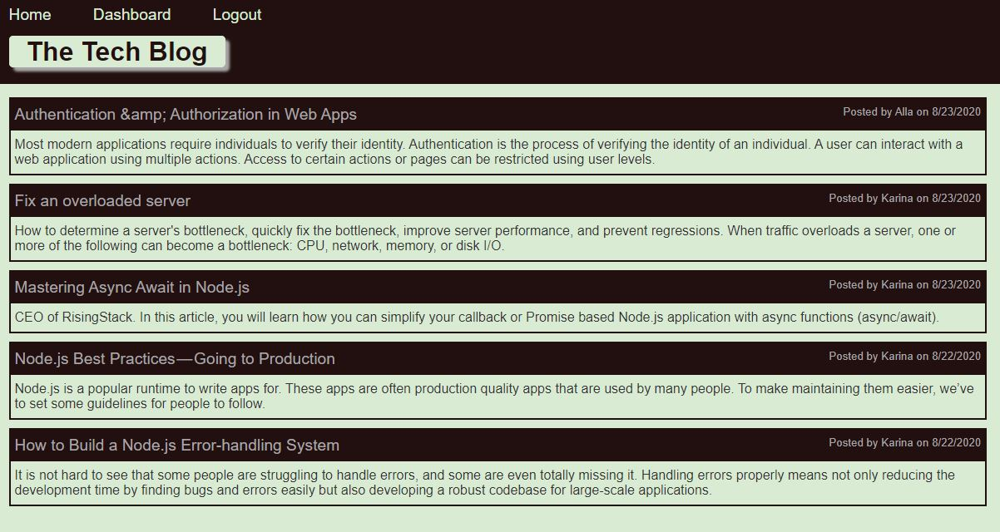

# TechBlog

Tech Blog application allows users to create posts and leave comments. A user needs to login to be able to create, edit or delete a post, as well as to leave a comment.

# Technologies used

* Node.js
* Express.js APIs
* npm, MySQL2, Sequelize, dotenv, experess-handlebars, bcrypt, express-session, connect-session-sequelize
* MySQL database
* Insomnia
* ORM
* MVC

# Deployed application link:

https://immense-reaches-05057.herokuapp.com/

# GitHub repository

You can find the repository here: https://github.com/evkonradi/techBlog.

# Page preview

This is the preview of the initial page:

